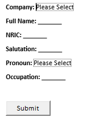
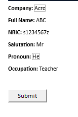
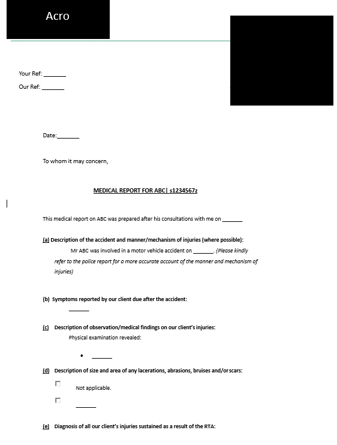
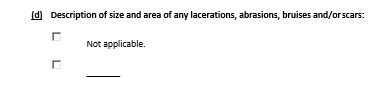
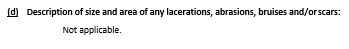

### Form Template

This template was created for a client who required a word document template with the following requirements:

- 1. Different templates for different companies
- 2. Pre-filled fields at the appropriate locations within the template
- 3. Only allows users to fill in at selected areas within the template

## Skills used in this project

- Combining bookmarks and VBA
- Restricting editing
- Form Fields

---

# General Idea

Have a User Interface page for the user to select pre-filled fields

 
Once the fields are filled and the submit button is clicked, the template is generated with the relevant fields filled.

 

Where there are checkboxes, these can be ticked to select the option required. Options not ticked will be deleted.
For example:
From this:

To:

